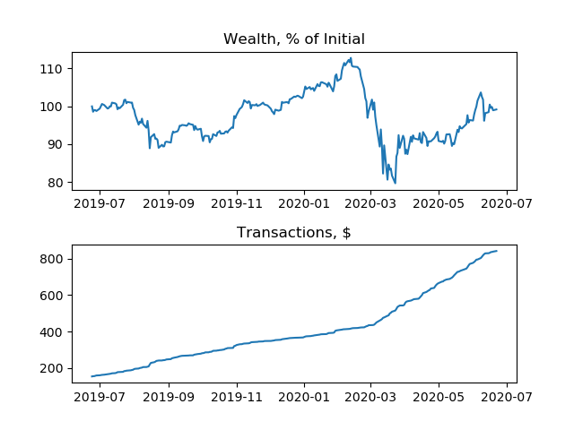
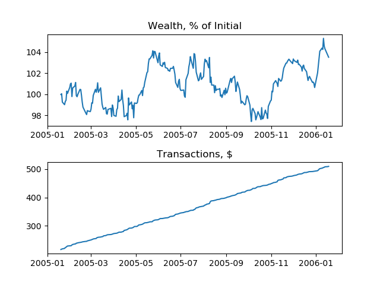
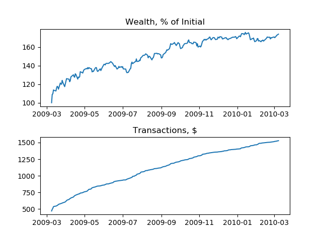
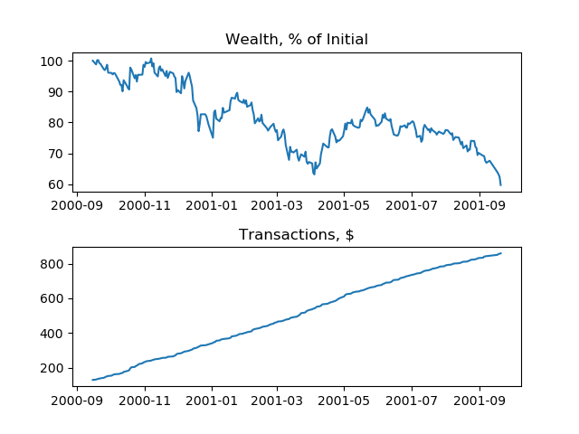
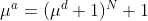
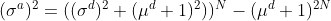
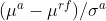

# Constant Mix Visualizer

This visualizer shows the performance of a constant mix portfolio for 3 stocks over 20 years and subset ranges. The strategy maintains equal wealth for stocks and the money market balance ($1:MSFT, $1:GE, $1:CISCO, $1:MM) and rebalances daily. Graphs, stats, discussion, and definitions below.

### Full 20 years
 

### Most volatile year
 

### Least volatile year
 

### Best year
 

### Worst year
 

|  | All 20 years| Most volatile year| Least volatile year | Best year | Worst year |
| :---------------- | :---------- | :------- | :-------- | :------- | :------- |
| Turnover | 85.681 % | 187.194 % | 123.022 % | 129.865 % | 284.480 % |
| Annualized return | 2.454 % | -0.499 % | 3.482 % | 53.235 % | -49.140 % |
| Expense ratio | 0.485 % | 0.085 % | 0.049 % | 0.088 % | 0.144 % | 
| Max drawdown | 54.543 % | 29.321 % | 6.430 % | 8.314 % | 40.651 % |
| Sharpe ratio | 0.013 | -0.013 | 0.011 | 0.342 | -0.912 |

### Discussion

The adjusted close price is used for each stock. The specific time range is 6/26/2000 - 6/25/2020 inclusive. Initial Wealth is $1M. The cost to trade is a flat $0.005 per share. And money market return is the 3 month Treasury rate converted to a daily rate, then compounded over the previous calendar days.

Turnover: The full 20 years is lower than even the most stable year, because the transaction costs to buy a portfolio on day 1 dominates over daily rebalancing costs over the rest of the year. For the year-long subsets, the most volatile year was higher than the most stable year as expected. However, the worst year had much higher turnover than any other year-long subset. This is because the prices of the three stocks diverged significantly from the initial bounds in the dot-com crash.  

Annualized rate of return: For the full 20 years, constant mix of the three stocks has higher annualized return than the 1.746% for the Dow, if the Dow were used for a portfolio without transaction. The disparity in returns is because I only kept 3 companies that would still remain high on the list over the past 20 years; as compared to the Dow, which adjusted its components over the years to maintain representation of the market, but created turnover. The most volatile year was worse than the most stable year as expected, since volatility increases turnover.

Expense ratio: same explanations as turnover

Max drawdown: During the full 20 years, the 3 stocks faced higher drawdown at some point than even the worst year as expected, because drawdowns can last longer than a year. The most volatile year had a higher max drawdown than the most stable year, likely since volatility increases the chance of a high drawdown. The best year had lower max drawdown than the worst year; likely because the best year had to increase more than the worst year, decreasing the chance of the drawdown over the year.

Sharpe ratio: The Sharpe ratios for year-long subsets are not representative of any strategy, so these should be disregarded. For a 20 year term, the Sharpe ratio can be interpreted meaningfully. The Sharpe ratio of .013 is considered a poor investment, and marginally better than just relying on the money market. Again, I selected 3 companies that would remain high on the list over the past 20 years, which boosted portfolio return. Beyond that, a constant mix portfolio weighted by price creates higher turnover than a portfolio weighted by market cap. And daily rebalancing generates higher turnover than less frequent rebalancing. Turnover causes transaction costs and decreases return. 

#### Definitions
[Turnover](https://www.investopedia.com/terms/a/annual-turnover.asp)

Annualized Return,  

Annualized Variance,  

Expense ratio = Cumulative transaction costs / Final wealth

[Drawdown](https://en.wikipedia.org/wiki/Drawdown_(economics))

Sharpe Ratio,  

Formula Image Generator: https://www.codecogs.com/latex/eqneditor.php
