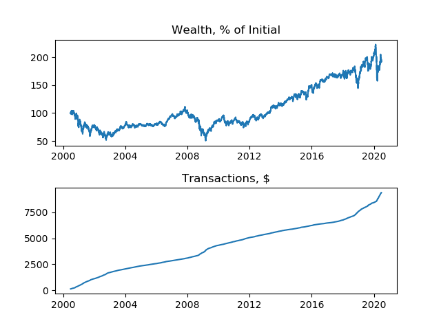

# Constant Mix Visualizer

This visualizer shows the performance of a constant mix portfolio for 3 stocks over the past 20 years and subset ranges. The strategy maintains equal wealth for stocks and the money market balance ($1:MSFT, $1:GE, $1:CISCO, $1:MM) and rebalances daily. The adjusted close price is used for each stock. The specific time range is 6/26/2000 - 6/25/2020 inclusive. Initial Wealth is $1M. The cost to trade is a flat $0.005 per share. And money market return is 0%

### Full 20 years
 

#### Statistics

Turnover: 85.674 %

Annualized rate of return: 2.242 %

Expense ratio: 0.497 %

Max drawdown: 54.770 %

Sharpe ratio: 0.191
