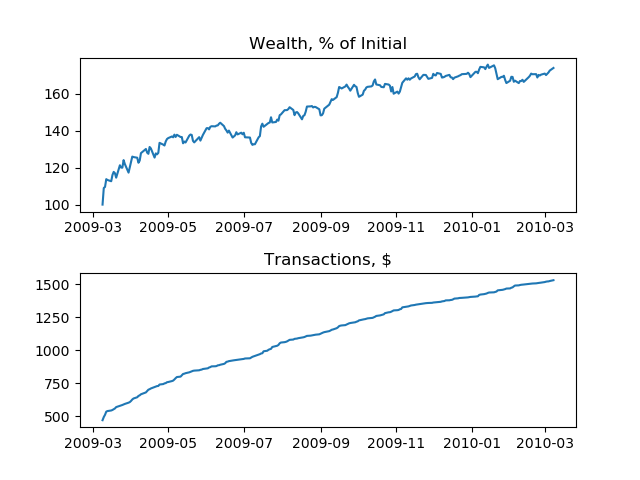

# Constant Mix Visualizer

This visualizer shows the performance of a constant mix portfolio for 3 stocks over the past 20 years and subset ranges. The strategy maintains equal wealth for stocks and the money market balance ($1:MSFT, $1:GE, $1:CISCO, $1:MM) and rebalances daily. The adjusted close price is used for each stock. The specific time range is 6/26/2000 - 6/25/2020 inclusive. Initial Wealth is $1M. The cost to trade is a flat $0.005 per share. And money market return is the 3 month Treasury rate converted to a daily rate, then compounded over the previous calendar days.

### Full 20 years
 

#### Statistics

Turnover: 85.681 %

Annualized rate of return: 2.454 %

Expense ratio: 0.485 %

Max drawdown: 54.543 %

Sharpe ratio: 0.013

### Most volatile year
 

#### Statistics

Turnover: 187.194 %

Annualized rate of return: -0.499 %

Expense ratio: 0.085 %

Max drawdown: 29.321 %

Sharpe ratio: -0.013

### Least volatile year
 

#### Statistics

Turnover: 123.022 %

Annualized rate of return: 3.482 %

Expense ratio: 0.049 %

Max drawdown: 6.430 %

Sharpe ratio: 0.011

### Best year
 

#### Statistics

Turnover: 129.865 %

Annualized rate of return: 53.235 %

Expense ratio: 0.088 %

Max drawdown: 8.314 %

Sharpe ratio: 0.342

### Worst year
 

#### Statistics

Turnover: 284.480 %

Annualized rate of return: -49.140 %

Expense ratio: 0.144 %

Max drawdown: 40.651 %

Sharpe ratio: -0.912

#### Definitions
[Turnover](https://www.investopedia.com/terms/a/annual-turnover.asp)

TODO Annualized mean return formula in Latex

TODO Annualized variance formula in Latex

Expense ratio = Cumulative transaction costs / Final wealth

[Drawdown](https://en.wikipedia.org/wiki/Drawdown_(economics))

Sharpe Ratio  = Annualized Mean / sqrt(Annualized Variance)
